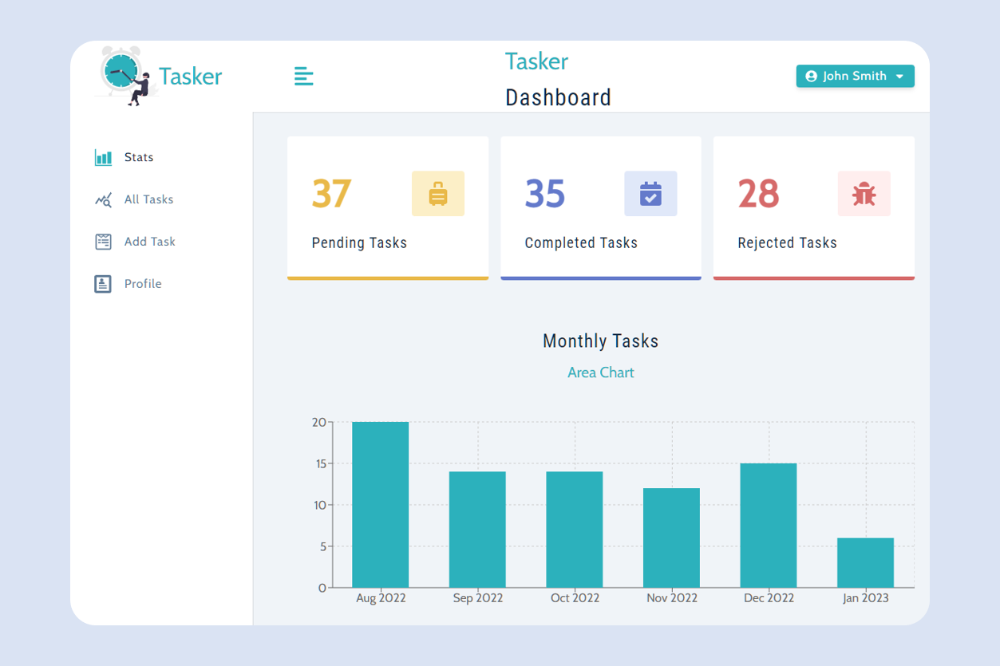

# Taskify

#### Track Your Tasks

Developed web application to track common tasks associated with property management and client interaction.
Features task list search and sort, filtering, and data visualization using Recharts library.
Using Node.js and Express backend and connecting to MongoDB through Mongoose.
Illustrations sourced from [Undraw](https://undraw.co/illustrations).

#### Live Demo

Project in Action - [Tasker](https://tasker-server-7afi.onrender.com/)

